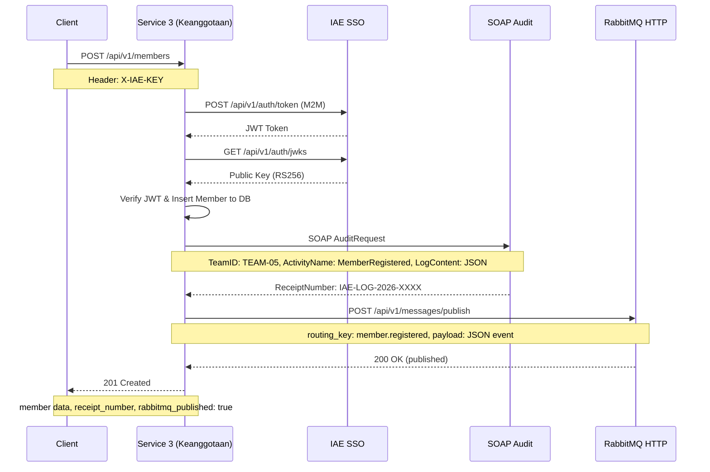

# Analisis Tugas 3 - Service Keanggotaan (IAE-T2)

## Identitas Mahasiswa

| Field | Keterangan |
|-------|------------|
| Nama | Veraldo Bahriansyah |
| NIM | 102022400180 |
| Kelas | SI4808 |
| Service | Service 3 - Keanggotaan |
| Team ID | TEAM-05 |

---

## 1. Identifikasi Transaksi Kritis

### Transaksi yang Dipilih: Pendaftaran Member Baru
**Endpoint:** `POST /api/v1/members`

### Justifikasi
Transaksi `POST /api/v1/members` dipilih sebagai transaksi kritis karena:

1. **State-Changing** — Transaksi ini mengubah state database secara permanen
   dengan melakukan insert data member baru ke tabel `members`.

2. **Kritis secara bisnis** — Dalam alur bisnis E-Library, seluruh proses
   peminjaman buku bergantung pada keberadaan member yang terdaftar. Tanpa
   member yang valid, pengguna tidak dapat mengakses layanan peminjaman
   (Service 2 - Loans).

3. **Memerlukan Audit (SOAP)** — Setiap registrasi member baru harus dicatat
   ke sistem audit legacy (IAE Central) sebagai bukti aktivitas bisnis yang
   sah dan dapat dipertanggungjawabkan.

4. **Perlu Disebarkan (RabbitMQ)** — Setelah member berhasil didaftarkan,
   event `member.registered` perlu dipublikasikan ke Message Broker agar
   service lain (terutama Service 2 - Loans) dapat mengetahui adanya member
   baru yang siap menggunakan layanan.

### Alur Transaksi Kritis dalam Konteks E-Library
Berdasarkan alur proses bisnis Peminjaman Buku E-Library:
- Nomor 5: Sistem mengecek status keaktifan member → `GET /api/v1/members/{id}/status`
- Nomor 6: Sistem memeriksa detail profil member → `GET /api/v1/members/{id}`
- Nomor 7: Platform memproses pembuatan token validasi akses → `POST /api/v1/members`

---

## 2. Skema Integrasi

### Modul 1: Federated SSO
- **URL SSO:** `https://iae-sso.virtualfri.id`
- **Endpoint Token:** `POST /api/v1/auth/token`
- **Endpoint JWKS:** `GET /api/v1/auth/jwks`
- **Mekanisme:** JWT (RS256) dari Cloud Dosen diverifikasi menggunakan public
  key dari endpoint `/api/v1/auth/jwks`
- **Mapping:** Payload JWT di-decode dan di-mapping ke tabel roles lokal
- **Status:** BERHASIL — Token JWT berhasil didapat dan di-decode

### Modul 2: SOAP XML Client
- **URL SOAP:** `https://iae-sso.virtualfri.id/soap/v1/audit`
- **Team ID:** TEAM-05
- **Trigger:** Setiap `POST /api/v1/members` berhasil → kirim audit ke SOAP
- **Data yang dikirim:**
  - `TeamID`: TEAM-05
  - `ActivityName`: MemberRegistered
  - `LogContent`: Data member dalam format JSON (CDATA)
- **Response yang disimpan:** `ReceiptNumber` dari IAE Central
- **Status:** BERHASIL — Contoh ReceiptNumber: `IAE-LOG-2026-C9B82E1A`

### Modul 3: AMQP Publisher (RabbitMQ)
- **URL Publish:** `https://iae-sso.virtualfri.id/api/v1/messages/publish`
- **Exchange:** `iae.central.exchange`
- **Routing Key:** `member.registered`
- **Trigger:** Setelah SOAP audit sukses → publish event ke RabbitMQ
- **Payload:**
```json
{
  "event": "member.registered",
  "service": "Keanggotaan-Service",
  "data": {
    "member_id": 10,
    "name": "Veraldo RabbitMQ 4",
    "email": "veraldo.rabbitmq4@email.com",
    "status": "active"
  },
  "timestamp": "2026-06-18T14:04:41.000000Z"
}
```
- **Status:** BERHASIL — `rabbitmq_published: true`

---

## 3. Sequence Diagram



---

## 4. Skema Role Lokal (SSO Mapping)

| JWT Claim | Tabel Lokal | Keterangan |
|-----------|-------------|------------|
| `sub` | `members.sso_id` | ID unik dari SSO |
| `profile.name` | `members.name` | Nama pengguna |
| `profile.email` | `members.email` | Email pengguna |
| default | `members.role` | Default role: member |

### Role Mapping
| Role SSO | Role Lokal | Akses |
|----------|------------|-------|
| `admin` | `administrator` | Full access |
| `member` | `member` | Read + borrow |
| `guest` | `guest` | Read only |

---

## 5. Bukti Capaian Teknis

| Modul | Status | Bukti |
|-------|--------|-------|
| Modul 1: Federated SSO | ✅ BERHASIL | JWT berhasil di-decode, member ter-mapping ke DB lokal |
| Modul 2: SOAP XML Client | ✅ BERHASIL | ReceiptNumber: IAE-LOG-2026-C9B82E1A |
| Modul 3: AMQP Publisher | ✅ BERHASIL | rabbitmq_published: true |
| Modul 4: AI Prompting Log | ✅ BERHASIL | File AI-prompting-log.md tersedia di repository |